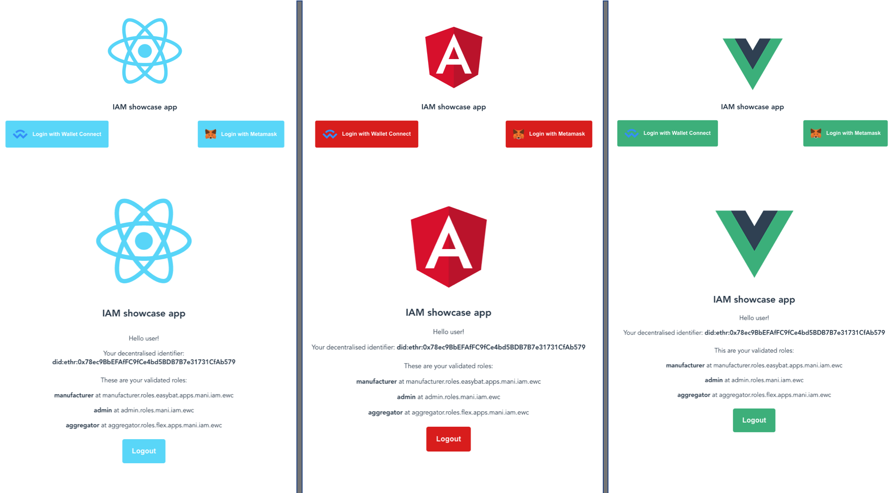

<p align="center">
  
</p>

# Identity and Access Management (IAM) Client Library

TypeScript library to be used within decentralized applications for authentication and authorization using DIDs (Decentralized Identifiers) and VCs (Verifiable Credentials)

##



## Live Demos

[ React Demo](https://did-auth-demo.energyweb.org/react-example/) / [ Angular Demo](https://did-auth-demo.energyweb.org/angular-example/) / [ Vue Demo](https://did-auth-demo.energyweb.org/vue-example/)

Demo source code: [iam-client-examples](https://github.com/energywebfoundation/iam-client-examples)

## Documentation

[Read the Docs](https://energy-web-foundation-iam-client-lib.readthedocs-hosted.com/_/sharing/ojw5kxd0al7k1llbcp78i6oiv)

## Getting Started

For development purposes, please follow below steps to integrate the library with your dApps.

### Prerequisites

`iam-client-lib` is written in TypeScript. Make sure to have Node.js (>= v10) installed. Create a folder named **_iam-client-lib_** and clone this GIT project.

Also note that having a DID document with a public key is a prerequisite for using iam-client-lib and during initialization the library with attempt to add a public key to the DID document if one doesn't exist. This addition of the public key requires the account to be funded.

`iam-client-lib` has a WebAssembly dependency. Some bundlers/frameworks doesn't support it out of the box, so some action are required. Here is a list of known problems:

- **Angular** - you'll have to add following in you `package.json`

```
"browser": {
    "fs": false,
    "os": false,
    "path": false
  }
```

- **React** - you'll have to add a `wasm-loader` for the files with `.wasm` extension to your Webpack configuration. To edit Webpack config you can use [@craco/craco](https://www.npmjs.com/package/@craco/craco) or [react-app-rewired](https://www.npmjs.com/package/react-app-rewired).

### Install

Latest stable version

```sh
npm i iam-client-lib
```

Prerelease version

```sh
npm i iam-client-lib@canary
```

Some library dependencies require Node.js built-ins. Therefore when library is used in browser make sure they are polyfilled. If application is bundled with Webpack dependencies can be polyfilled with [node-polyfill-webpack-plugin](https://www.npmjs.com/package/node-polyfill-webpack-plugin)

### Initialization

Because of dependencies between modules they should be initialized in right order. This is achieved by accessing module initializer from initialization function of required module.

1. Initializing signer service. It will initialize staking and messaging services and allow to connect to cache server

```js
  const {
      signerService,
      messagingService,
      connectToCacheServer,
  } = await initWithPrivateKeySigner(privateKey, rpcUrl)
```

2. Connecting to cache server. Depending on signer type signature might be requested

```js
// IAM has builtin default settings for VOLTA CHAIN, which can overriden
// 1111 is an example of another ChainID (https://chainlist.org/)
setChainConfig(1111, {
  didContractAddress: '0x3e2fb24edc3536d655720280b427c91bcb55f3d6',
  ensRegistryAddress: '0xa372d665f83197a63bbe633ebe19c7bfd4943003',
  ensResolverAddress: '0xe878bdcf5148307378043bfd2b584909aa48a227',
  rpcUrl: 'http://some-rpc.com',
});

setMessagingConfig(1111, {
    messagingMethod: MessagingMethod.Nats,
    natsServerUrl: 'https://some-exchange-server.com'
})

setCacheConfig(1111, {
    url: 'https://some-cache-server.com/',
    cacheServerSupportsAuth: true,
})

const { cacheClient, domainsService, connectToDidRegistry } =
  await connectToCacheServer();
```

3. Connecting to DID registry.

```js
const { didRegistry, claimsService } = await connectToDidRegistry();
```

## Development

For testing use `npm run test:watch`

### Installing Dependencies

Using `npm` to install dependencies:

```sh
npm install ./energyweb-km-utils-v1.0.0.tgz
```

```sh
npm install ./energyweb-km-crypto-v1.0.0.tgz
```

```sh
npm install
```

### Compile & Build

To generate bundled JS files and types, use the following command. Generated files are located in the **_dist_** folder.

```sh
npm run build
```

## Active Maintainers

* [John Henderson](https://github.com/jrhender)
* [Dmitry Fesenko](https://github.com/JGiter)
* [Jakub Sydor](https://github.com/Harasz)
* [Ashish Tripathi](https://github.com/nichonien)

## Contributing

Please read [CONTRIBUTING.md](https://gist.github.com/PurpleBooth/b24679402957c63ec426) for details on our code of conduct, and the process for submitting pull requests to us.

## License

This project is licensed under the GNU General Public License v3.0 or later - see the [LICENSE](LICENSE) file for details

## FAQ

Frequently asked questions and their answers will be collected here.
