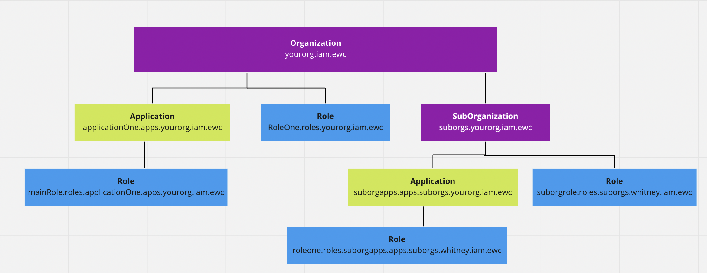

# Domains

Currently the iam-client library supports two domains: **[Organization](../guides/organization.md)** and **[Application](../guides/application/md)**. 

## Domain Hierarchy

1. An **[Organization](../guides/organization.md)** is the top-level domain. It can have an unlimited number of sub-organizations underneath of it. 

2. An **[Application](../guides/application.md)** is nested under an Organization or a Sub-organization. An Organization or Sub-organization can have an unlimited number of Applications. 

3. **A [Role](../guides/role.md)** is nested under an Organization or an Application. A Role is used to define an actor within an Organization or an Application, and criteria for participation. A user can submit claims (verifiable credentials) to prove that they meet the criteria that the Role requires. Other parties can verify these claims.

### Example:
- Energy Web Foundation is an **Organization**,
- Decentralized Service Bus is an **Application** belonging to Energy Web Foundation.
- Message Broker is a **Role** within the Decentralized Service Bus. A user must have a DID from a pre-defined list in order to take on the role of 

